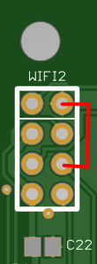

View this project on [CADLAB.io](https://cadlab.io/project/24310). 

# ESP8266-RGBW-S-R

**ESP8266**-based **RGBW** controller with **S**ensor and **R**elay support.

This harware design (PCB) is based on the [ESP-GO project and Hackitt & Bodgitt board](https://tech.scargill.net/home-control-2018/) created by [Pete Scargill](https://tech.scargill.net/) and [Aidan Ruff](https://www.scargill.net/cv/).

## Power supply
AC 110-220V or DC 5V, DC 5-24V.

### AC 110-220V, 5V needed
Use **PSU-A** HLK-PM01, output DC 5V. DC 3.3V via onboard LM1117-3.3.

### AC 110-220V, NO 5V needed
Use **PSU-D** HLK-2M03, output DC 3.3V. Short J4 to supply 3.3V directly from DC-DC convertor.

### DC 5V
Use **PSU-B** B0503S, output DC 3.3V. No onboard 3.3 regulator needed. Short J4 to supply 3.3V directly from DC-DC convertor.

### DC 5-24V
Use **PSU-C** LM2596-based buck convertor. Set output to 5V and use onboard LM1117-3.3. Or set output to 3.3V and short **J4** to supply 3.3V directly from DC-DC convertor.

## Errors found

In version **0.7** I was trying to use pull-down resistors for PWM output pins, but it turned out that ESP can not start if TX (GPIO1) pin is pulled low during the boot. So please just **remove R25** (don't solder it). PWM works fine without it (and probably without R22-R24 too :) ), and it was not in the original version.

I did not use R8 (remove) either because it seems it is duplicated by R11.

Apparently, GPIO4 and GPIO5 are misplaced on the schematic (correct on the PCB footprint).

## Soldering

### Basic

#### SMD
* LK2 - just short it if you use LED strip and use input power for them.
* R3
* R4
* R5
* R7
* R10
* R11
* R16
* R12
* C5
* C6
* ESP (sometimes better to solder manually to avoid shotage under the ESP)

If using non 3.3V input and need on-board linear converter:
* C2
* C3
* C4
* C22
* C27
* IC6

Short JP4 **only if you have 3.3V input** already and do not need any extra converters. Input 5V line will be directly connected with internal 3.3V line.

#### THT
* C1 (not nessecery with a good DC-DC converter with capacitor on-board)
* LED2 (status)
* X1 (for PWM RGBW) 
* JP10 (for programming)
* PSU (check voltage on regulated converters). See «Power supply» section above.

## Temp/Humidity sensor, IC2
### SMD
* R21

## PWM RGBW (3A/ch max)
### SMD
* R22
* R23
* R24
* R17
* R18
* R19
* R20
* Q3
* Q4
* Q5
* Q6

## Relay
Have not tested. Solder according to schematic.

## Programming
I did not use ATtiny85. To switch ESP to programming mode short pins **2** (PROG) and **6** (GND) on **JP3**.

## License

Shield: [![CC BY-SA 4.0][cc-by-sa-shield]][cc-by-sa]

This work is licensed under a
[Creative Commons Attribution-ShareAlike 4.0 International License][cc-by-sa].

[![CC BY-SA 4.0][cc-by-sa-image]][cc-by-sa]

[cc-by-sa]: http://creativecommons.org/licenses/by-sa/4.0/
[cc-by-sa-image]: https://licensebuttons.net/l/by-sa/4.0/88x31.png
[cc-by-sa-shield]: https://img.shields.io/badge/License-CC%20BY--SA%204.0-lightgrey.svg

## Disclaimer

THIS HARDWARE AND/OR SOFTWARE IS PROVIDED BY THE COPYRIGHT HOLDERS AND CONTRIBUTORS “AS IS” AND ANY EXPRESS OR IMPLIED WARRANTIES, INCLUDING, BUT NOT LIMITED TO, THE IMPLIED WARRANTIES OF MERCHANTABILITY AND FITNESS FOR A PARTICULAR PURPOSE ARE DISCLAIMED. IN NO EVENT SHALL THE COPYRIGHT OWNER OR CONTRIBUTORS BE LIABLE FOR ANY DIRECT, INDIRECT, INCIDENTAL, SPECIAL, EXEMPLARY, OR CONSEQUENTIAL DAMAGES (INCLUDING, BUT NOT LIMITED TO, PROCUREMENT OF SUBSTITUTE GOODS OR SERVICES; LOSS OF USE, DATA, OR PROFITS; OR BUSINESS INTERRUPTION) HOWEVER CAUSED AND ON ANY THEORY OF LIABILITY, WHETHER IN CONTRACT, STRICT LIABILITY, OR TORT (INCLUDING NEGLIGENCE OR OTHERWISE) ARISING IN ANY WAY OUT OF THE USE OF THIS SOFTWARE, EVEN IF ADVISED OF THE POSSIBILITY OF SUCH DAMAGE.